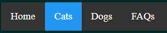
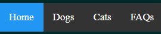
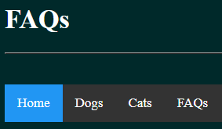
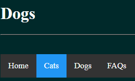
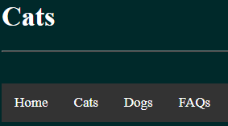
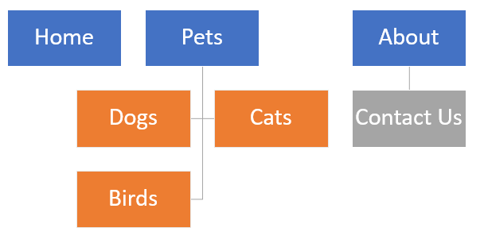
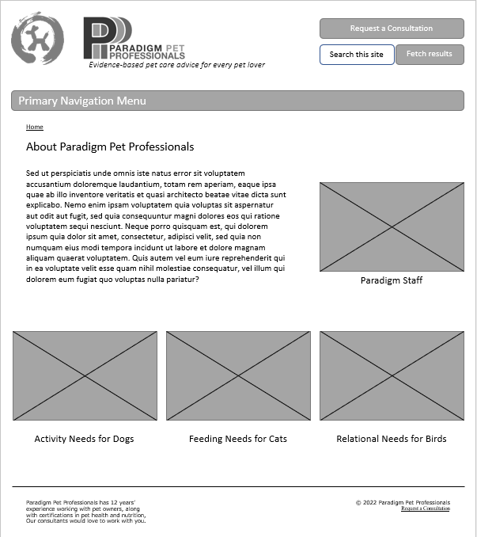

<html>

<head>
<meta http-equiv=Content-Type content="text/html; charset=windows-1252">
<meta name=Generator content="Microsoft Word 15 (filtered)">

<!--
 /* Font Definitions */
 @font-face
	{font-family:Wingdings;
	panose-1:5 0 0 0 0 0 0 0 0 0;}
@font-face
	{font-family:"Cambria Math";
	panose-1:2 4 5 3 5 4 6 3 2 4;}
@font-face
	{font-family:Calibri;
	panose-1:2 15 5 2 2 2 4 3 2 4;}
 /* Style Definitions */
 p.MsoNormal, li.MsoNormal, div.MsoNormal
	{margin-top:0in;
	margin-right:0in;
	margin-bottom:8.0pt;
	margin-left:0in;
	line-height:107%;
	font-size:11.0pt;
	font-family:"Calibri",sans-serif;}
p.MsoListParagraph, li.MsoListParagraph, div.MsoListParagraph
	{margin-top:0in;
	margin-right:0in;
	margin-bottom:8.0pt;
	margin-left:.5in;
	line-height:107%;
	font-size:11.0pt;
	font-family:"Calibri",sans-serif;}
p.MsoListParagraphCxSpFirst, li.MsoListParagraphCxSpFirst, div.MsoListParagraphCxSpFirst
	{margin-top:0in;
	margin-right:0in;
	margin-bottom:0in;
	margin-left:.5in;
	line-height:107%;
	font-size:11.0pt;
	font-family:"Calibri",sans-serif;}
p.MsoListParagraphCxSpMiddle, li.MsoListParagraphCxSpMiddle, div.MsoListParagraphCxSpMiddle
	{margin-top:0in;
	margin-right:0in;
	margin-bottom:0in;
	margin-left:.5in;
	line-height:107%;
	font-size:11.0pt;
	font-family:"Calibri",sans-serif;}
p.MsoListParagraphCxSpLast, li.MsoListParagraphCxSpLast, div.MsoListParagraphCxSpLast
	{margin-top:0in;
	margin-right:0in;
	margin-bottom:8.0pt;
	margin-left:.5in;
	line-height:107%;
	font-size:11.0pt;
	font-family:"Calibri",sans-serif;}
.MsoChpDefault
	{font-family:"Calibri",sans-serif;}
.MsoPapDefault
	{margin-bottom:8.0pt;
	line-height:107%;}
 /* Page Definitions */
 @page WordSection1
	{size:8.5in 11.0in;
	margin:1.0in 1.0in 1.0in 1.0in;}
div.WordSection1
	{page:WordSection1;}
 /* List Definitions */
 ol
	{margin-bottom:0in;}
ul
	{margin-bottom:0in;}
-->

</head>

<body lang=EN-US link="#0563C1" vlink="#954F72" style='word-wrap:break-word'>
	

<h1>Preview Coming Soon!</h1>
<!--

Jack T. Neely

&nbsp;

A.

1.&nbsp;&nbsp;&nbsp;&nbsp;&nbsp;&nbsp; The
target audience<i> </i>needs more resources regarding rescue and adoption. This
is not provided.

a.&nbsp;&nbsp;&nbsp;&nbsp;&nbsp;&nbsp;
Stakeholders need for there to be visible contact information, so users
can book consultations. This is not provided.

b.&nbsp;&nbsp;&nbsp;&nbsp;&nbsp;&nbsp;
All site visitors need contact information to be able to inquire about
consultations. This is not provided.

c.&nbsp;&nbsp;&nbsp;&nbsp;&nbsp;&nbsp;
Dog owners need to know how to select toys for their dog, which is not
provided content.

d.&nbsp;&nbsp;&nbsp;&nbsp;&nbsp;&nbsp;
Cat owners need to know where they can adopt a cat, which is not
provided.

e.&nbsp;&nbsp;&nbsp;&nbsp;&nbsp;&nbsp;
Bird owners need a page dedicated to their pet, which is not provided.

  

&nbsp;
  

2.&nbsp;&nbsp;&nbsp;&nbsp;&nbsp;&nbsp; The
target audience<i> </i>needs consistency in navigation between pages. This is
currently not provided, as the links for the <i>Dogs</i> and <i>Cats</i> pages
are not located in the same position as visitors change pages. As you can see, <i>Cats</i>
and <i>Dogs </i>switch places, while the rest of the navigation menu remains in
place. 
 

a.&nbsp;&nbsp;&nbsp;&nbsp;&nbsp;&nbsp;
Stakeholders need visitors to be able to access the <i>Home </i>page
from the <i>FAQs</i> page. The link currently points to [<i>redacted for
  publication</i>] which is not useful.

b.&nbsp;&nbsp;&nbsp;&nbsp;&nbsp;&nbsp;
All site visitors need to know they’re on the correct page when they
visit FAQs, which is not obvious on the top navigation bar, as it displays <i>Home</i>
as the highlighted page.

c.&nbsp;&nbsp;&nbsp;&nbsp;&nbsp;&nbsp;
Dog owners need a way to tell they’re on the correct page for their pet,
which is not obvious on the top navigation bar, as it displays <i>Cats</i> as
the highlighted page. 

d.&nbsp;&nbsp;&nbsp;&nbsp;&nbsp;&nbsp;
Cat owners need a way to tell they’re on the correct page for their pet,
which is not obvious on the top navigation bar, which does not display which
page the user is on.

e.&nbsp;&nbsp;&nbsp;&nbsp;&nbsp;&nbsp;
Bird owners need a webpage they can access through easy, obvious
navigation. Currently, no page exists.

  

&nbsp;

3.&nbsp;&nbsp;&nbsp;&nbsp;&nbsp;&nbsp; The
target audience<i> </i>needs additional links added to the navigation bar,
which include <i>Contact, About, </i>and<i> Birds.</i> These links are not
provided.

a.&nbsp;&nbsp;&nbsp;&nbsp;&nbsp;&nbsp;
Stakeholders need a <i>Contact</i> navigation link for users to book
consultations. This is not provided.

b.&nbsp;&nbsp;&nbsp;&nbsp;&nbsp;&nbsp;
All site visitors need a <i>Contact </i>navigation link to inquire about
consultations.

c.&nbsp;&nbsp;&nbsp;&nbsp;&nbsp;&nbsp;
Dog owners need a navigation link to visit an <i>About </i>page to view
company information. This is not provided.

d.&nbsp;&nbsp;&nbsp;&nbsp;&nbsp;&nbsp;
Cat owners need a navigation link to visit an<i> About </i>page to view company
information. This is not provided.

e.&nbsp;&nbsp;&nbsp;&nbsp;&nbsp;&nbsp;
Bird owners need a navigation link to visit a<b> </b><i>Birds</i> page,
which is not provided.

&nbsp;
  
  

B.

1.&nbsp;&nbsp;&nbsp;&nbsp;&nbsp;&nbsp; The
target audience needs clear and visible image content with alternate text tags
for interactivity and accessibility. I will include these images and tags.

  

a.&nbsp;&nbsp;&nbsp;&nbsp;&nbsp;&nbsp;
Stakeholders need visible branding displayed on the page along with
alternate tags that display text when hovering over these brand images. I will
include these images and tags.

b.&nbsp;&nbsp;&nbsp;&nbsp;&nbsp;&nbsp;
All site visitors need friendly and inviting imagery that they can
interact with, and I will include these user-friendly images along with
alternate tags that display text when hovering over the images.

c.&nbsp;&nbsp;&nbsp;&nbsp;&nbsp;&nbsp;
Dog owners need images of dogs and alternate tags that display text when
hovering over these images and I will include these images and tags.

d.&nbsp;&nbsp;&nbsp;&nbsp;&nbsp;&nbsp;
Cat owners need images of cats and alternate tags that display text when
hovering over these images and I will include these images and tags.

e.&nbsp;&nbsp;&nbsp;&nbsp;&nbsp;&nbsp;
Bird owners need images of birds and alternate tags that display text
when hovering over these images and I will include these images and tags.

  

&nbsp;
    

2.&nbsp;&nbsp;&nbsp;&nbsp;&nbsp;&nbsp; The
target audience should include bird owners, and I will create a <i>Birds </i>page
for this.

a.&nbsp;&nbsp;&nbsp;&nbsp;&nbsp;&nbsp;
Stakeholders need bird owners to be included as a target demographic,
and I will address this by creating a <i>Birds</i> page with relevant content.

b.&nbsp;&nbsp;&nbsp;&nbsp;&nbsp;&nbsp;
All site visitors need diversity and inclusivity for types of owners and
pets, and I will address this by creating a <i>Birds</i> page with relevant
content.

c.&nbsp;&nbsp;&nbsp;&nbsp;&nbsp;&nbsp;
Bird owners need a dedicated <i>Birds</i> page with relevant content,
such as information about the types of birds, like Cuban bee hummingbirds and
ostriches, as well as the range of temperament among birds, bird health, and
more, as bird owners are interested in the emotional wellbeing of their pets. I
will create this dedicated <i>Birds</i> page for bird owners and fill it with
various bird-related information.

  

&nbsp;
    

3.&nbsp;&nbsp;&nbsp;&nbsp;&nbsp;&nbsp; The
target audience needs consistency in site structure, and the current <i>FAQs</i>
page fails to keep information centralized to its topic. I will address this
issue by removing the <i>FAQs</i> page altogether. Any site visitor with
questions that are not addressed by site content should be able to locate the <i>Contact</i>
page to contact the business and schedule a consultation.

&nbsp;

4.&nbsp;&nbsp;&nbsp;&nbsp;&nbsp;&nbsp; <u>Sitemap 
</u>

5.&nbsp;&nbsp;&nbsp;&nbsp;&nbsp;&nbsp; Users
need to quickly locate information about the business, including how to contact
the business owners. I will create an <i>About </i>page dedicated to this and
label that as part of the navigation for the site. This navigation will be
visible at the top of each page, making it easy to find this page from anywhere
on the site. When users visit this page, they will only be presented with
relevant information about the business. Additionally, site visitors need to
quickly locate contact information for the business. I will include a <i>Contact
Us</i> page will be listed under the <i>About</i> link for navigation, making
it easy for site visitors to locate contact information for the business. Site
visitors need to be able to quickly navigate back to the <i>Home</i> page, for
ease and familiarity during site navigation. I will keep the <i>Home</i> link
included in the top navigation bar for all web pages. Lastly, site visitors
need to be able to access information about their pets. I will include a <i>Pets</i>
link in the top navigation bar, which will expand to include separate links
designated for <i>Cats, Dogs, </i>and <i>Birds </i>respectively.

 

&nbsp;

6.&nbsp;&nbsp;&nbsp;&nbsp;&nbsp;&nbsp; The
primary navigation will be a navigation bar menu at the top of the page. This
will have dynamic drop-down functionality. Users will be able to locate this
easily and access all pages to visit as a readily available link. This will
contain primary links: <i>Home, Pets, </i>and <i>About. Pets</i> will contain
drop-down links to <i>Cats, Dogs, </i>and <i>Birds. About</i> will contain a
drop-down link to <i>Contact Us.</i> This ensures that all site visitors are
easily able to identify their navigation needs and find the appropriate page
for them. This fulfills stakeholder needs by allowing visitors to quickly
locate pertinent information and schedule a consultation. 

The secondary
navigation will be a breadcrumb menu. All site visitors can benefit from
knowing where on the site they are located, how that fits into the structure of
the site, and how they can return to the <i>Home </i>page. This fulfills
stakeholder needs by allowing visitors to know where they are on the site—the
page and how it fits into the hierarchy—as well as enhancing SEO and driving
potential customers to the site. 
 

 

&nbsp;

&nbsp;

C. &nbsp;<u>Medium-Fidelity Wireframe</u>

<u>&nbsp;</u>

<u>&nbsp;</u>

<u>&nbsp;</u>

&nbsp;

D. &nbsp;<u>Maintenance Plan</u>

• &nbsp;On the 1st
Monday of each month, we will perform routine accessibility maintenance by
testing universal website accessibility by utilizing the W3C <i>Web Content
Accessibility Guidelines (WCAG). </i>This will meet stakeholder needs by
adhering to a set of accessibility standards.

• &nbsp;On the 2nd
Monday of each month, we will perform routine Search Engine Optimization
maintenance by ensuring that the site appears on the first page of search
engine results for the search queries “new pet consultation” and “new pet care
consultation.” This will meet stakeholder SEO needs and steer visitors toward
the site to ensure adequate revenue.

• &nbsp;On the 3rd
Monday of each month, we will perform routine hyperlink and image maintenance.
This will involve checking every link embedded on every page to confirm that
the link opens the target page. This will also involve checking every
navigation item to ensure that it resolves to the proper page. Additionally, we
will check that every image displays properly on every webpage. This will meet
stakeholder needs by ensuring optimal functionality, which will result in
happier, less frustrated, and less confused visitors. This will also meet
stakeholder needs by ensuring that visitors are greeted by imagery that aligns
with their needs and interests and elicits positive associations with the
brand.

• &nbsp;On the 4th
Monday of each month, we will perform routine display and rendering maintenance
by testing the website on devices with differently sized viewports. We will
ensure dynamic response using Bootstrap CSS standards, such as using viewport
attribute tags and displaying content using percentages, as opposed to, for
example, fixed-width. This will meet stakeholder needs by ensuring an optimal
experience on viewing devices of all sizes.

• &nbsp;On the 1st
Tuesday of every month, we will update the XML sitemap for the website on a
quarterly basis to ensure Search Engine Optimization for mobile devices. We
will also perform routine maintenance on title tags and meta descriptions. We
will ensure short, user-friendly URLs for ease of use for mobile devices. We
will ensure that the site is responsive to mobile device viewports and that
there is a mobile-friendly navigation menu. This will meet stakeholder needs of
ensuring site accessibility for pet owners on the go, training their pets, and
more. 

  

&nbsp;

&nbsp;

Up Next: <a href="https://github.com/JackTNeely/UIprototype" target="_blank">Check Out the Protoype!</a>
 

Thank you.
  

&nbsp;

&nbsp;

&nbsp;

&nbsp;

-->

</body>

</html>
